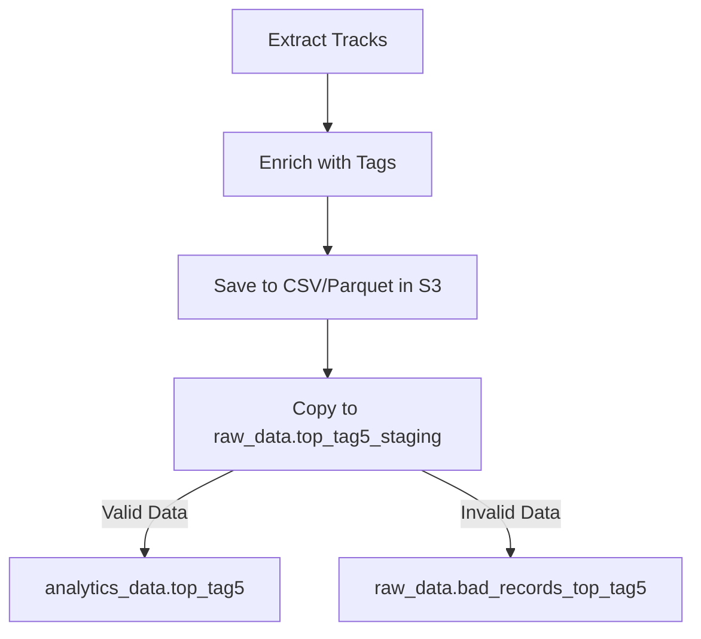

# ADR-007: [staging 테이블 기능 강화 및 사용 여부]

** 📅 날짜**: 2025-07-25

** 🎯 주제**: 데이터 검증 로직을 **Python 기반 → SQL 기반 Staging 테이블 방식**으로 전환

## 📝 상황 (Context)

- 기존 파이프라인에서는 API로 받은 데이터를 **Python(Pandas)에서 유효성 검증 후** Redshift에 적재했다.
- 하지만 이 방식은:
    1. Python 쪽 코드가 복잡해지고, 검증 로직이 분산됨
    2. 검증 실패 데이터를 추적·관리하기 어려움
    3. 데이터 품질 모니터링 및 감사(Audit)가 힘듦
        
        → 즉, **데이터 품질 관리 및 분석 가시성이 부족**했다.
        

## 💡 고려된 옵션

1. **기존 방식 유지**
    - Pandas로 검증 후 Redshift에 INSERT
    - 장점: 구현 단순, 빠른 속도
    - 단점: 실패 데이터 추적 불가, 운영/분석 로그 부족
2. **Staging 테이블을 이용한 SQL 기반 검증** ✅ **(선택)**
    - S3 → Redshift Staging → SQL로 검증 및 분류
    - 장점:
        - Redshift 내에서 일관된 품질 검증 가능
        - 실패 데이터(`bad_records`)를 별도 테이블에 기록
        - Superset/BI에서 품질 모니터링 가능
    - 단점: SQL 쿼리 추가, COPY 후 검증 단계가 늘어나 약간의 지연 발생

## ✅ 결정 (Decision)

- **Staging 테이블(`raw_data.top_tag5_staging`)을 사용하여 데이터 검증 및 분류를 수행한다.**
- 검증 후:
    - 유효한 데이터 → `analytics_data.top_tag5`
    - 유효하지 않은 데이터 → `raw_data.bad_records_top_tag5` (error_reason 포함)
- 기존의 `raw_data.top_tag5`는 더 이상 운영용으로 사용하지 않고, 모든 운영 데이터는 `analytics_data.top_tag5`를 기준으로 관리한다.

## 📌 근거 (Rationale)

- **데이터 품질 모니터링 가능** → 실패 데이터를 `bad_records`에 기록
- **운영과 분석의 분리** → Raw/Staging/Analytics 스키마를 단계별로 구분
- **ETL 표준화** → 데이터 품질 검증 책임을 SQL로 일원화, Python 로직 단순화
- **확장성** → 추후 Data Quality Rule 추가 시 SQL만 변경하면 됨

## 📈 기대 효과

1. **데이터 품질 개선**
    - Null 값, 중복, 비정상 데이터 검출 및 관리 가능
2. **운영 가시성 확보**
    - `bad_records_top_tag5`를 기반으로 이상치 대시보드 구성 가능
3. **유연한 확장성**
    - 검증 로직을 SQL 기반으로 쉽게 추가/변경 가능

## 🧩 변경된 파이프라인 흐름

## 💬 추가 참고사항

- 기존 `raw_data.top_tag5` 데이터는 **모두 `analytics_data.top_tag5`로 이관** 완료
- 새로운 로그 테이블 `analytics_data.format_compare`를 통해 CSV/Parquet 성능 비교 실험도 진행
- Superset을 활용해 `bad_records_top_tag5`와 `format_compare`를 시각화 및 모니터링 예정
</aside>
